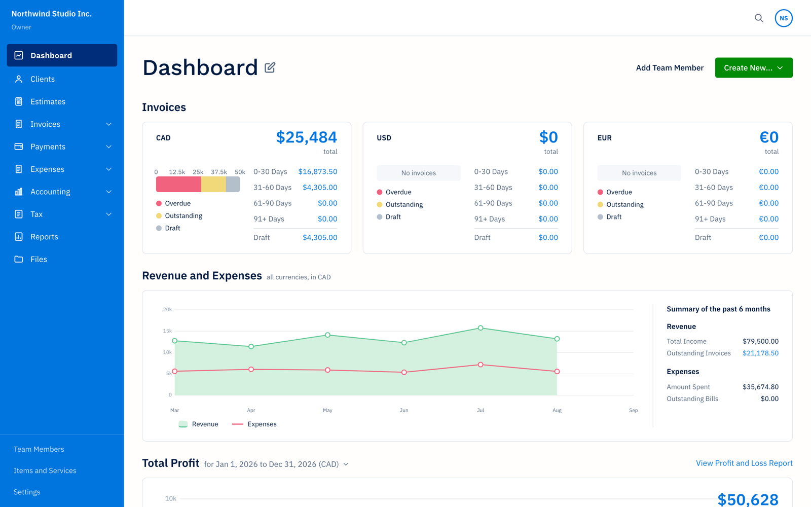
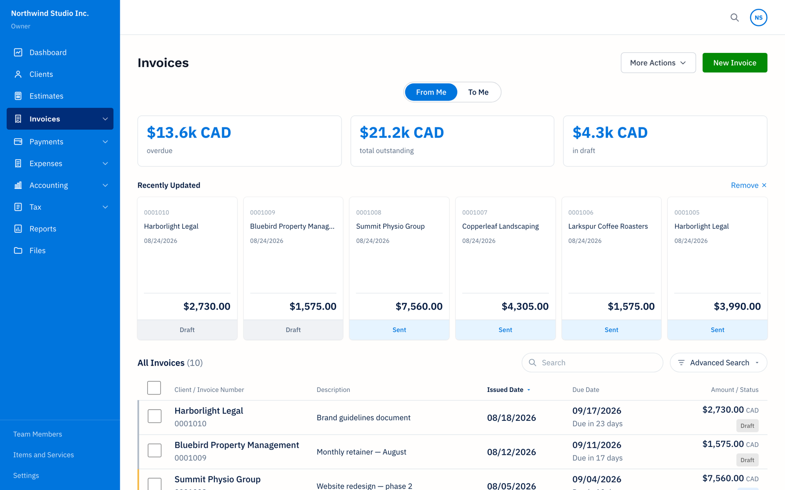
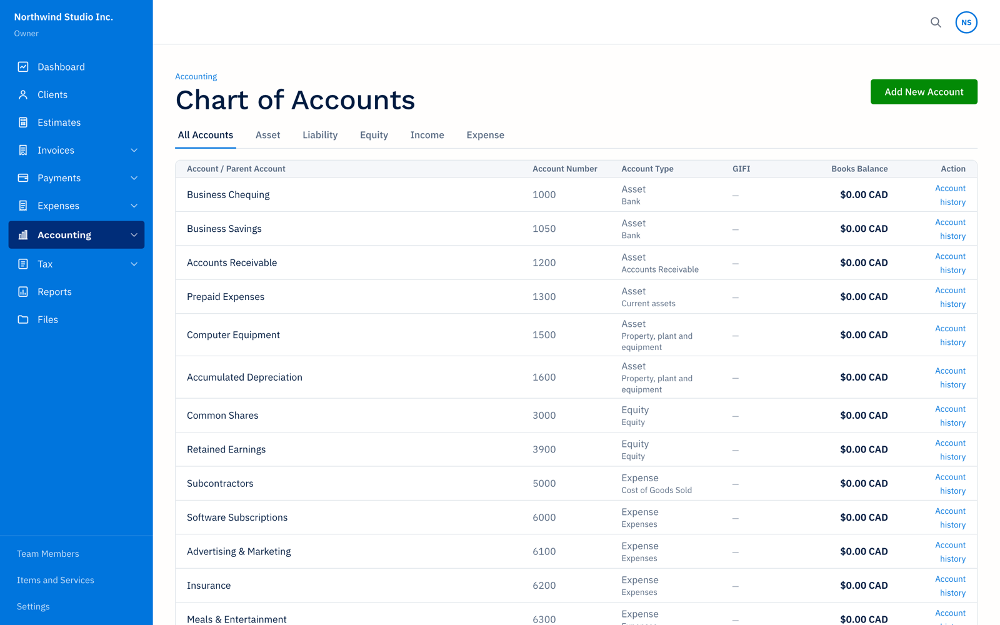
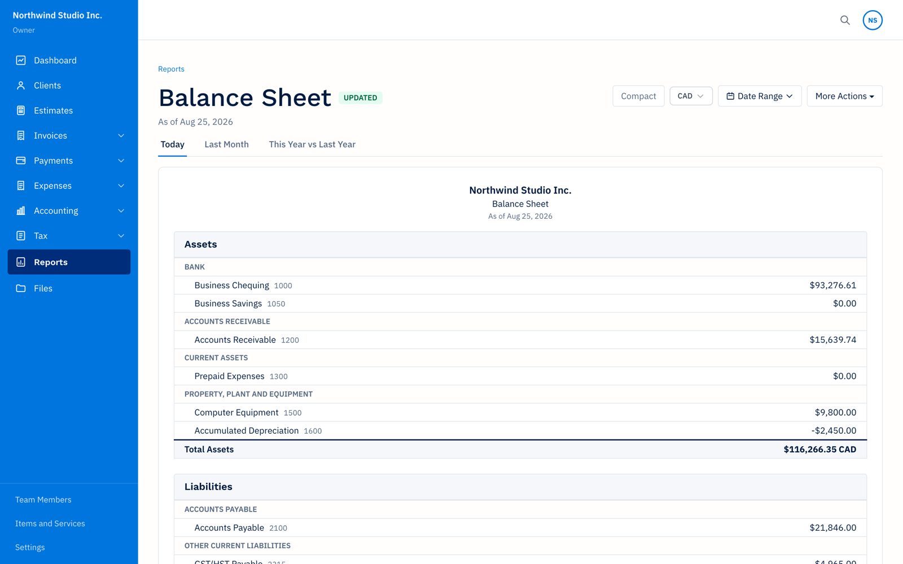

# Books

A self-hosted invoicing & accounting app you actually own. Built with Next.js 16, Prisma, Postgres, Redis, and NextAuth.

<table>
  <tr>
    <td></td>
    <td></td>
  </tr>
  <tr>
    <td></td>
    <td></td>
  </tr>
</table>

## Why this exists

I ran my business on a mainstream accounting SaaS for years. One day I went to add a single new client and hit a paywall: the next tier was **double** the monthly price — for one more row in a table. That was the nudge. I opened Claude Code and started building the tool I wished I was paying for: invoicing, expenses, full double-entry accounting, bank feeds, reports, and Canadian tax filing, running on my own server with my own data.

Books is the result. It is opinionated toward a small owner-operated business, but it is a complete system: clients, estimates, invoices (with online payment via Stripe), recurring billing, expenses and receipts, time tracking, vendors and bills, bank import/reconciliation, multi-currency invoicing with automatic FX rates and revaluation, a real general ledger with period locking, P&L / balance sheet / cash-flow / sales-tax reports, and a tax module. No per-seat pricing, no client caps, no upsells.

### Built for AI agents

Because it was built *with* an agent, it was also built *for* one. Every meaningful action is an API route, and the machine-facing ones (`/api/invoices`, `/api/invoices/{id}` (GET/PUT), `/api/payments`, `/api/journal-entries`, `/api/gl-accounts`, `/api/banking/*`, `/api/files/*`, `/api/forecasts/*` (reads), …) accept a bearer token (`FILES_API_TOKEN`) as well as a browser session. That means you can point Claude Code, an MCP server, a cron job, or any script at your instance and get an effective AI bookkeeper:

- drop a folder of receipts in and have them uploaded, OCR'd (Claude vision), and filed against the right expense accounts
- pull pending bank transactions, categorize / match / split them, and post the journal entries
- draft and send invoices, record payments, and chase overdue balances
- ask plain-English questions against the ledger and get answers that tie out to the reports

You stay in control — the agent works through the same audited, period-locked endpoints the UI uses, and every mutation lands in the audit log.

## Forecasts

Books ships with a second surface, **Forecasts**, toggled from the sidebar. It is a
month-by-month cash-flow planner (ported from a standalone desktop tool) that lives
alongside the accounting side without touching it:

- **Two scenarios out of the box.** *Business* is linked to Books: income rows are your
  active clients (invoiced this month or last) with collected payments as actuals, open
  invoices on their expected pay date (the client's average days-to-pay, else the due
  date), and drafts and recurring templates projected forward; expense rows come from
  open bills, recurring items, and categorized spend at a trailing run rate; cash on
  hand anchors to your bank GL balances. Months Books already knows about are locked;
  future months with nothing scheduled are yours to forecast, and Books replaces them
  as you invoice. *Personal* is fully manual, with an optional "From Business" row fed
  by the GL accounts you pay yourself from.
- **Spreadsheet grid** with formulas (`=income.Salary * 0.9`, cross-month references),
  fill-down, drag reorder, and per-cell "lands on day N" for a day-by-day timeline.
- **Pages:** Overview, Cash Flow (daily timeline + monthly), Income, Expenses, Taxes
  (basic projected corporate or personal bill using the tax module's rate tables),
  Debts (amortizing loans, linked payments), Assets (net worth), Settings (FX
  overrides, exports).
- **Agent-readable.** `GET /api/forecasts/{id}/projection?asOf=YYYY-MM-DD` returns the
  expected balance, low point ahead, monthly totals, dated upcoming events, and which
  rows and months are Books-backed vs manual; `GET /api/forecasts/{id}/taxes` returns
  the projected bill. Reads accept the bearer token; every write requires a session.

## Stack

- **Framework:** Next.js 16 (App Router) + React 19
- **Auth:** NextAuth v5 (credentials + 2FA via `otpauth`)
- **DB:** Postgres via Prisma 6
- **Cache/sessions:** Redis (ioredis)
- **Payments:** Stripe
- **PDFs:** `@react-pdf/renderer`
- **Styling:** Tailwind CSS v4
- **Process manager (prod):** pm2
- **Reverse proxy (prod):** Apache + Let's Encrypt

## Repo layout

```
books/
├── app/                    # Next.js app (all application code)
│   ├── src/
│   ├── prisma/schema.prisma
│   ├── scripts/            # seed, wipe, deploy, data fixes
│   ├── deploy/             # Apache vhost configs (real ones gitignored)
│   └── .env.example
├── data/                   # Seed JSON (gitignored — real business data)
├── screenshots/            # UI reference captures (gitignored)
└── memory/                 # Local notes (gitignored)
```

## Prerequisites

- Node.js ≥ 20
- Docker (includes Docker Compose v2)

## Local development

### Quick start

The fastest path is the setup wizard. From the repo root:

```bash
./setup.sh
```

It will:
1. Start Postgres + Redis (Docker)
2. Install npm deps
3. Walk you through company setup, admin user, and optional Stripe / email
4. Write a secure `.env`, run migrations, and seed your admin

Then:

```bash
cd app && npm run dev
```

Open <http://localhost:3000> and log in with the admin you just created.

### Manual setup (advanced)

If you want to see what the wizard does under the hood, or drive each step yourself:

#### 1. Start Postgres + Redis

From the repo root:

```bash
docker compose up -d
```

This starts Postgres 16 on `localhost:5432` and Redis 7 on `localhost:6379` with the default credentials used in `.env.example` (user `books`, password `books`, db `books`). Data persists in named Docker volumes (`books-postgres`, `books-redis`).

Stop with `docker compose down`. To wipe the DB, `docker compose down -v`.

#### 2. Install

```bash
cd app
npm install
```

#### 3. Configure env

```bash
cp .env.example .env
```

The defaults in `app/.env.example` match the docker-compose services — you only need to set `NEXTAUTH_SECRET`:

```bash
# inside app/.env
NEXTAUTH_SECRET="$(openssl rand -base64 32)"
```

Optional (for Stripe features):

```
STRIPE_SECRET_KEY="sk_test_..."
STRIPE_PUBLISHABLE_KEY="pk_test_..."
STRIPE_WEBHOOK_SECRET="whsec_..."
```

#### 4. Push the Prisma schema

```bash
cd app
npx prisma generate
npx prisma db push
```

#### 5. Seed (optional)

Seed data is loaded from `../data/*.json` (gitignored). If you don't have a seed snapshot, skip this step — the app will run empty.

```bash
npm run seed
```

The seed script creates an admin user; credentials are printed to stdout on first run (or see `scripts/seed.ts`).

#### 6. Run the dev server

```bash
npm run dev
```

Open <http://localhost:3000>.

## Scripts

Run from inside `app/`:

| Command | What it does |
|---|---|
| `npm run dev` | Next.js dev server |
| `npm run build` | Production build |
| `npm start` | Run the production build |
| `npm run lint` | ESLint |
| `npm run seed` | Seed DB from `data/*.json` |
| `npx tsx scripts/wipe-data.ts` | Wipe tenant data (preserves users + company settings) |
| `npx tsx scripts/delete-old-admin.ts` | Remove the seeded admin |
| `npx tsx scripts/seed-phase2.ts` | Seed expenses + time tracking |
| `npx tsx scripts/data-stats.ts` | Print row counts |

Data repair scripts (`fix-*.ts`) and the CSV/JSON importers (`seed*.ts`) were written for the original migration and are kept for reference — a fresh install does not need them.

## Production deployment

> **New to this?** [**docs/DEPLOYMENT.md**](docs/DEPLOYMENT.md) is a painstaking, zero-to-deployed
> guide — buy a domain, spin up a DigitalOcean/AWS server, lock it down, point DNS (with optional
> Cloudflare), install everything, fill in every env var, and get HTTPS — written for someone who
> has never deployed a web app. The notes below are the quick reference for people who already
> have a server.

The repo ships **example** deploy artifacts. Copy each to its real filename (which is gitignored) and fill in your server details.

| Example (committed) | Real (gitignored) |
|---|---|
| `app/deploy/vhost.example.conf` | `app/deploy/<yourdomain>.conf` |
| `app/ecosystem.config.example.js` | `app/ecosystem.config.js` |
| `app/scripts/deploy.example.sh` | `app/scripts/deploy.sh` |

### Server-side setup (one time)

1. Install Node 20+, Postgres, Redis, Apache, pm2.
2. Create DB user + database; record the connection string.
3. Clone the repo to `/var/www/accounting` (or wherever `REMOTE_DIR` points).
4. Create `/var/www/accounting/.env` with production values (the deploy script deliberately does **not** overwrite it).
5. Enable Apache modules:
   ```bash
   a2enmod proxy proxy_http proxy_wstunnel ssl rewrite
   ```
6. Issue a TLS cert: `certbot --apache -d books.yourdomain.com`.
7. Drop your filled-in vhost into `/etc/apache2/sites-available/` and `a2ensite` it.
8. First-time start:
   ```bash
   cd /var/www/accounting
   npm ci
   npx prisma generate
   npx prisma db push
   pm2 start ecosystem.config.js
   pm2 save
   pm2 startup    # follow the printed command to auto-start on reboot
   ```

### Deploying updates (from your laptop)

```bash
cd app
./scripts/deploy.sh              # code + build + restart
./scripts/deploy.sh --schema     # + prisma db push
./scripts/deploy.sh --reseed     # + wipe tenant data + re-seed from ../data
```

The deploy script:
1. Runs a local typecheck (`tsc --noEmit`)
2. Rsyncs `app/` → remote (excludes `.env`, `node_modules`, `.next`, `src/generated`)
3. Optionally rsyncs `data/`
4. Runs `prisma generate` (and `db push` / seed if flagged)
5. Runs `npm run build`
6. Restarts pm2
7. Hits `/login` and `/dashboard` for a status-code health check

## Branding

The app is tenant-driven. A fresh install shows generic defaults ("Your Company") until you set your business info at **/settings → Business Profile**. The name, legal name, address, phone, email, and logo initials are stored in a `CompanySettings` singleton and flow through PDFs, emails, sidebar, login page, and public share pages.

## What's excluded from git

The root `.gitignore` keeps the following out of the repo:

- `data/` — real seed data (clients, invoices, payments)
- `screenshots/` — production UI captures
- `memory/`, `.claude/` — local editor/agent state
- `app/.env*` (except `.env.example`)
- Real deploy artifacts (`deploy/*.conf`, `ecosystem.config.js`, `scripts/deploy.sh`)
- `node_modules/`, `.next/`, `*.tsbuildinfo`, `.DS_Store`

If you're setting up a fresh clone, make sure to recreate those locally from the `.example` files.

## Troubleshooting

- **Postgres/Redis not reachable** — check `docker compose ps`. If the Postgres container is stuck, `docker compose down -v && docker compose up -d` will recreate it (destroys local DB data).
- **Port 5432 or 6379 already in use** — stop any host-installed Postgres/Redis (`brew services stop postgresql`, `brew services stop redis`) or edit the port mapping in `docker-compose.yml`.
- **`prisma generate` fails** — delete `app/src/generated/prisma` and retry.
- **NextAuth errors about `NEXTAUTH_URL`** — must match the URL you're visiting (scheme + host + port).
- **WebSocket / HMR fails behind Apache** — make sure `mod_proxy_wstunnel` is enabled and the `/ws` ProxyPass lines are present in the vhost.
- **Seed crashes with "data dir not found"** — seed expects `data/` as a sibling of `app/`. See `scripts/seed.ts` for the lookup paths.

## Built by

[@ramathornn](https://github.com/ramathornn), [@jordandepass](https://github.com/jordandepass) and Claude Code.

## License

[MIT](LICENSE)
